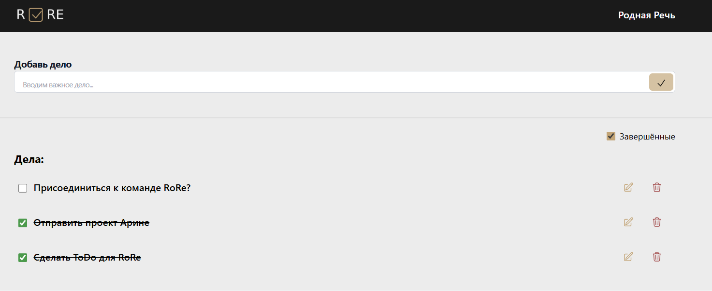

# 📋 ToDo — тестовое задание в стилях RoRe

Это небольшое тестовое приложение для управления задачами, оформленное в минималистичном стиле **RoRe**. Реализован базовый функционал: добавление, удаление, редактирование и сортировка задач, а также перетаскивание через **Drag & Drop**.

---

## 🚀 Используемые технологии

- ⚛️ **React** — библиотека для создания пользовательского интерфейса
- 💨 **Tailwind CSS** — утилитарный CSS-фреймворк
- 📝 **uuid** — генерация уникальных ID для задач
- 🧲 **hello-pangea/dnd** — drag & drop взаимодействие
- 📦 **localStorage** — хранение задач между сессиями
- 🧠 **React Hooks** — управление состоянием и жизненным циклом

---

## 📸 Скриншот интерфейса



---

## ⚙️ Установка и запуск проекта

### 1. Клонировать репозиторий

```bash
git clone https://github.com/aleks509/TodoList-RoRe.git
cd TodoList-RoRe

```

### 2. Не забудь установить зависимости

```bash
npm install

```

### 3. Запусти приложение

```bash
npm run dev

```
